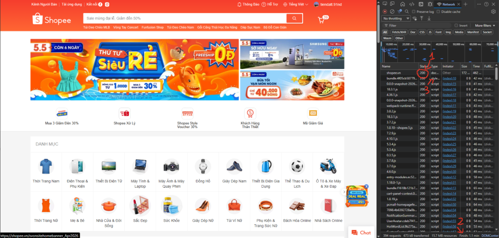
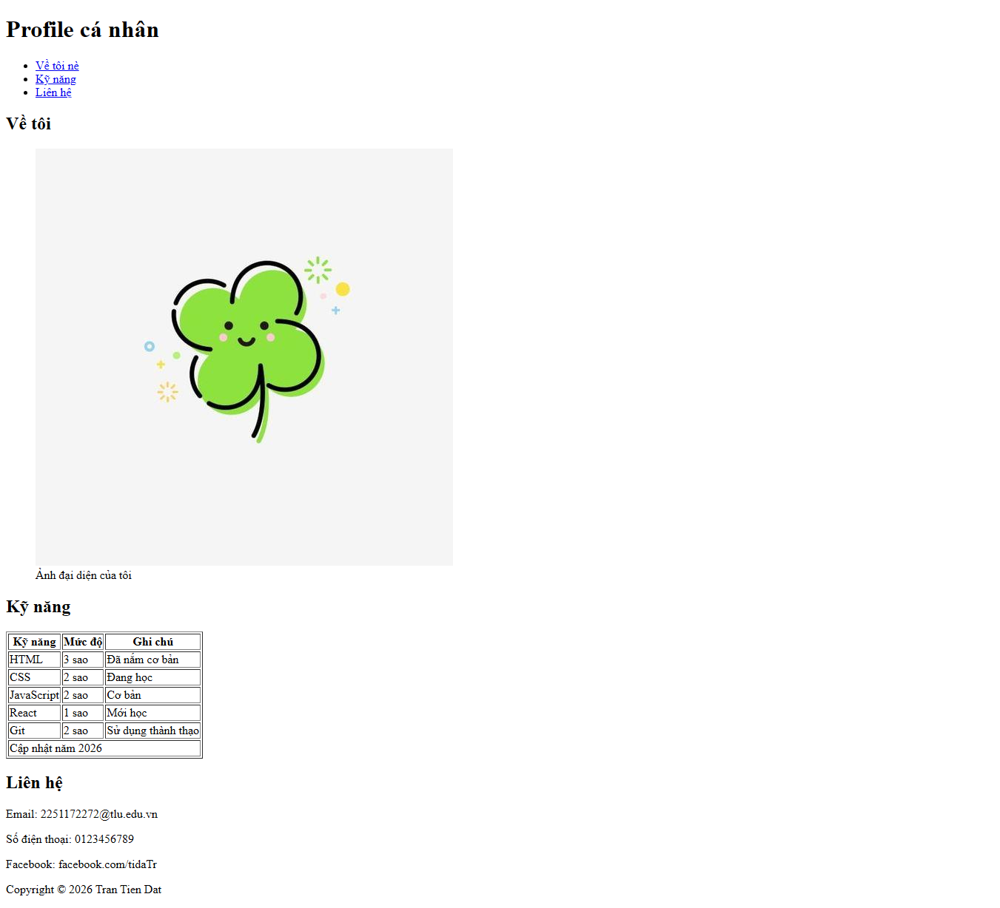

# PHẦN A

## Câu A1 - HTTP & Browser
Tài liệu tham chiếu: tuan_1_html5/01_introduction_html_universe.md - phần đầu tiên
1. Khi gõ https://shopee.vn sẽ xảy ra:
- Request từ laptop -> router wifi
- qua nhà mạng qua cáp quang
- đến data center của trụ sở shopee
- server xử lý request
- response ngược lại cho laptop
- trình duyệt nhận data HTML, CSS, JS -> hiển thị giao diện
  
2. Vào trang shopee.vn, mở DevTools -> tab Network sẽ thấy như ảnh


## Câu A2
Các l lỗi semantic
1. Dùng `<div>` vô nghĩa cho header
2. Dùng `<div>` vô nghĩa cho main
3. Không có `<nav>` để điều hướng menu
4. Không dùng `<article>` trong main cho 1 sản phẩm
5. Nên sử dụng các thẻ `<h2>` cho tiêu đề, `<p>` cho thẻ text và `` cho ảnh
5. Dùng `<div>` vô nghĩa cho footer

Sửa lại:

```html
<header>
    <div class="logo">ShopTLU</div>
    <nav class="menu">
        <a href="/">Trang chủ</a>
        <a href="/products">Sản phẩm</a>
    </nav>
</header>
<main>
    <article class="product">
        <h2 class="title">iPhone 16 Pro</h2>
        <p class="price">25.990.000đ</p>
        
    </article>
</main>

<footer>
    <p>© 2026 ShopTLU</p>
</footer>
```

## Câu A3
```text
Hộp 1
Text A Text B
Hộp 2
Text C Text D
Hộp 3
```
Giải thích: `<div>` thẻ này là thẻ dạng block chiếm hết chiều ngang, thẻ sau đó sẽ tự bị đẩy xuống dòng; `<span>` và `<strong>` thì dạng inline-block không chiếm hết dòng, hết thẻ không xuống dòng

## Câu A4
`<thead>` tiêu đề của cột, thường chữ sẽ to hơn in đậm hơn
`<tbody>` chứa dữ liệu chính, 1 bảng có thể có nhiều `<tbody>`
`<tfoot>` phần tổng kết cột

Tại sao không nên dùng `<table>` để tạo layout trang web?
- Vi phạm nguyên tắc Semantic, vì thẻ này sinh ra để hiển thị dữ liệu dạng bảng chứ không phải chia layout
- Tốc độ tải trang chậm vì phải tải hết cả cái bảng mới hiển thị nên nếu có nhiều dữ liệu thì nó rất lâu
- Vì nó không phù hợp để chia layout...

# PHẦN B

## Bài B1
