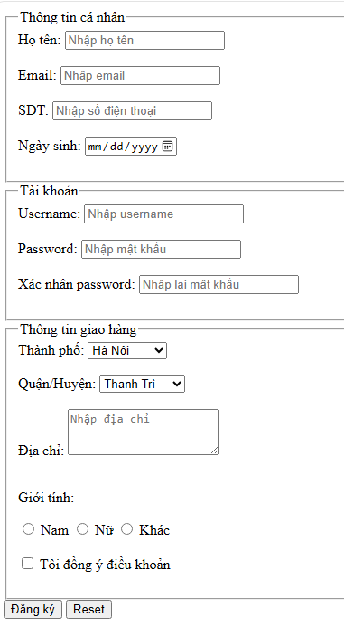
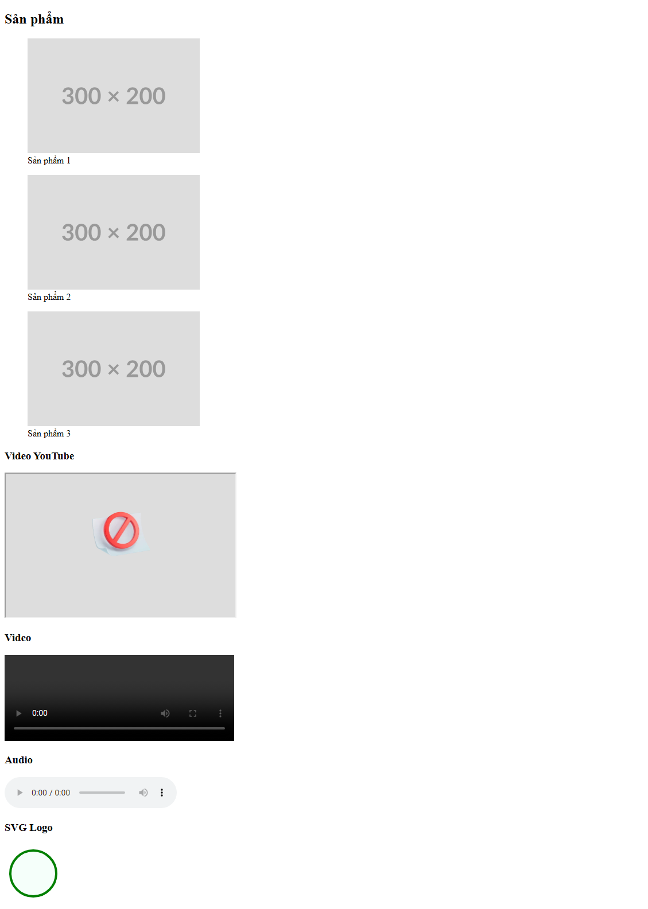
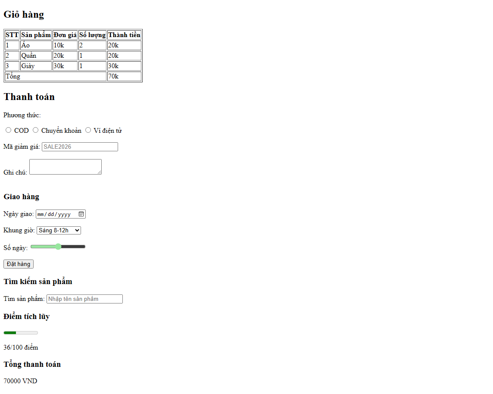

# PHẦN A

## CÂU A1
10 input types khác nhau trong HTML5:
1. type="email" -> Ô nhập text, tự kiểm tra có @ -> Dùng cho form đăng ký
2. type="text" -> Ô nhập text, có valitdate minlength, maxlength -> Dùng để nhập text cơ bản
3. type="password" -> Ô nhập text, tự ẩn ký tự -> Dùng để nhập mật khẩu
4. type="number" -> Nút +, - tăng giảm -> Tăng giảm số lượng
5. type="date" -> Tự động validate hợp lệ ngày tháng năm -> Chọn ngày tháng năm
6. type="url" -> Ô nhập text, Tự kiểm tra http:// và https:// -> gắn đường link
7. type="file" -> Dùng để upload file, ảnh
8. type="checkbox" -> Ô vuông tích chọn và bỏ chọn -> Dùng để chọn nhiều danh mục
9. type="radio" -> Nút tròn tích chọn và bỏ chọn -> Dùng để chọn 1 mục duy nhất
10. type="color" -> Ấn vào để chọn màu

## CÂU A2
- Trường hợp 1:
Form sẽ chặn lại và bắt mình phải nhập, không được bỏ trống
Vì có thuộc tính "required" bắt buộc người dùng không được để trống

- Trường hợp 2:
Form sẽ chặn lại và báo lỗi sai định dạng email @
Vì có type="email" nên dữ liệu nhập vào phải đúng định dạng có @ và tên miền phía sau

- Trường hợp 3:
Form sẽ chặn lại và báo lỗi giá trị quá lớn
Vì max="10" là giới hạn, user nhập 15 là lớn hơn giá trị giới hạn, báo lỗi

- Trường hợp 4:
Form sẽ chặn, và báo lỗi không đúng định dạng
Vì thuộc tính `pattern="[0-9]{10}"` yêu cầu phải nhập 10 chữ số từ 0 đến 9, user nhập abc là sai định dạng

- Trường hợp 5:
Form sẽ chặn, và báo lỗi mật khẩu chưa đúng yêu cầu
Input nhập password có thuộc tính minlength="8" tức mật khẩu phải có ít nhất 8 ký tự nhưng user nhập chưa đủ 8 ký tự, báo lỗi

## CÂU A3
- Form không có `<label for="email">` thì người dùng screen reader không biết ô nhập gì.

- Có thể sử dụng trong các form dài và phức tạp, `<fieldset>` dùng để bao bọc các ô input, `<legend>` dùng để thể hiện tiêu đề trong fieldset đó

Ví dụ cụ thể:
```
<fieldset>
    <legend>Nhập địa chỉ mua điện thoại đi</legend>
    <p>
        <label for="city">Thành phố:</label>
        <input type="text" id="city">
    </p>
    <p>
        <label for="address">Số nhà, tên đường:</label>
        <input type="text" id="address">
    </p>
</fieldset>
```

- aria-label được dùng cho trình đọc văn bản hiểu, dành cho những người có vấn đề về thị giác, ví dụ khi nhìn vào 1 button, người bình thường có thể hiểu nhưng những người khiếm khuyết thì không, khi đó dùng aria-label để họ có thể biết nút đó làm gì.
Và khi đã có `<label>` thì không nên dùng aria-label vì trình đọc màn hình có thể đọc 2 lần, gây trùng lặp

## CÂU A4
- Thuộc tính loading="lazy" là thuộc tính tải chậm cho hình ảnh, thay vì tải tất cả mọi ảnh khi vào 1 trang web, trình duyệt sẽ không tải các ảnh này khi nằm ngoài màn hình, chỉ khi user cuộn chuột gần đến mới tải
Thuộc tính này giúp tối ưu tốc độ tải trang web, giảm data mạng, không bị quá tải
Khôgn nên dùng khi: Ảnh ở ngay đầu trang, như logo hay banner

## CÂU A5
`` là thẻ nhúng ảnh vào
`<figure>` là thẻ semantic

Dùng `` khi chỉ cần hiển thị ảnh, nhìn vào là hiểu như logo, icon, không cần giải thích thêm nó là gì
Dùng `<figure>` khi muốn thể hiện chi tiết các thông tin bao gồm ảnh, chú thích, màu sắc,...

# PHẦN B

## Câu B1


## Câu B2


## Câu B3


# PHẦN C

## Câu C1
Lỗi 1: Dòng 2 — Input "Tên" không có `<label for="...">`, vi phạm accessibility
Sửa:
```
<label for="name">Tên:</label>
<input type="text" id="name" name="name" required>x
```

Lỗi 2: dòng 4 - input "email" thiếu `required`
sửa:
```
<label for="email">Email:</label>
<input type="email" id="email" name="email" required>
```

Lỗi 3: dòng 6 - password không có validate `minlength` `pattern`
sửa:
```
<label for="password">Mật khẩu:</label>
<input type="password" id="password" name="password" minlength=8 required>"
```

Lỗi 4: dòng 7 - nhập lại mật khẩu không có label + id
sửa:
```
<label for="confirm">Nhập lại mật khẩu:</label>
<input type="password" id="confirm" name="confirm" required>
```

Lỗi 5: dòng 9 - type phải là tel không phải text
sửa:
```
<label for="phone">Số điện thoại:</label>
<input type="tel" id="phone" name="phone" required>
```

Lỗi 6: dòng11 - select không có label
sửa:
```
<label for="city">Thành phố:</label>
<select id="city" name="city">
```

Lỗi 7: dòng 16 - không có input checkbox để chọn
sửa:
```
<input type="checkbox" id="agree" required>
<label for="agree">Tôi đồng ý điều khoản</label>
```

Lỗi 8: form thiếu method/action
sửa:
```
<form action="#" method="POST">
```

## Câu C2
1.
- Pattern cho CMND/CCCD 12 số
```
pattern="[0-9]{12}"
```
- Pattern cho STK 10-15 số
```
pattern="[0-9,a-z]{10,15}"
```

2. HTML5 validation không đủ an toàn cho ứng dụng ngân hàng vì:
- Có thể bypass dễ dàng bởi DevTools, xoá required or pattern là thấy hết
- Không bảo vệ dữ liệu phía server
-> Chỉ nên validate ở backend, HTML chỉ nên validate UI fe

3. Validate HTML không làm được:
- So sánh 2 password và nhập lại password giống nhau không
- Check dữ liệu đã tồn tại hay chưa
- Logic phức tạp

4. 2 rủi to nếu chỉ validate fe
- Bị tấn công vào CSDL
- Sai logic nghiệp vụ, dữ liệu rác