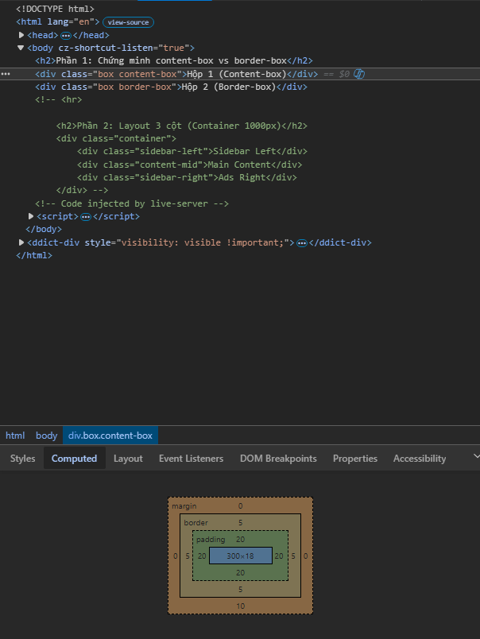
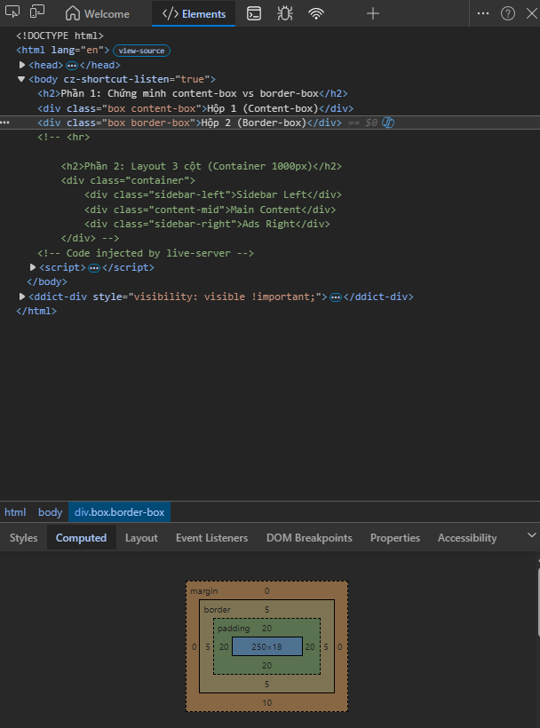
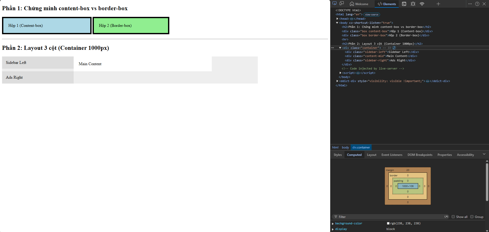
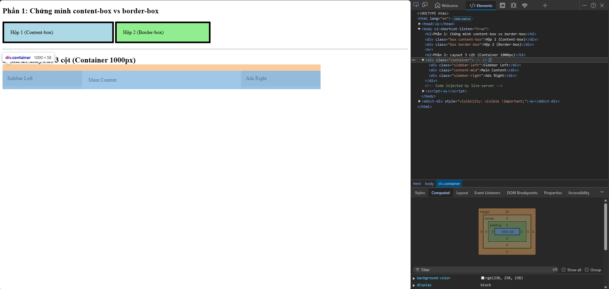
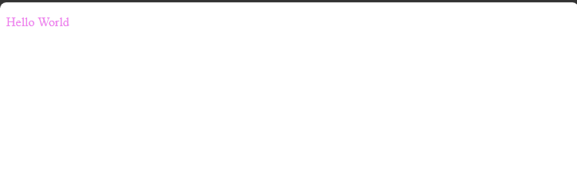

# PHẦN A
## CÂU A1
3 cách nhúng CSS vào HTML
1. Inline CSS (trong thẻ)
```
<h1 style="color: green; font-size: 28px;"> HIHI </h1>
```
Ưu điểm: Áp dụng nhanh chóng cho một element cụ thể, có độ ưu tiên cực cao  
Nhược: Làm code HTML rối, khó bảo trì  
Khi nào nên dùng: Cần thay đổi nhanh, ghi đè CSS style khác trong trường hợp khẩn cấp  

2. Internal CSS (trong `<style>`)
```
<head>
    <style>
        h1 { color: green; font-size: 28px; }
    </style>
</head>
```
Ưu: Không cần thêm file ngoài, tiện lợi.  
Nhược: Không tái sử dụng được, file HTML nặng hơn.  
Khi nào nên dùng: khi muốn viết CSS cho trang mà không muốn ảnh hưởng file tổng.  

3. External CSS (file riêng)
```
<head>
    <link rel="stylesheet" href="styles.css">
</head>
```
Ưu điểm: Tách biệt HTML và CSS, dễ bảo trì, có thể dùng chung 1 file CSS cho nhiều trang web, giúp trình duyệt lưu cache tốt hơn  
Nhược điểm: Tốn thêm một request HTTP để tải file CSS, có thể làm chậm tốc độ hiển thị trang lần đầu   
Khi nào dùng: Luôn luôn nên dùng cho các dự án thực tế và chuyên nghiệp    

Câu hỏi thêm:
Nếu cùng áp dụng cả 3, Inline CSS sẽ "thắng"  
Giải thích: Do cơ chế ưu tiên của CSS. Thứ tự ưu tiên là: Inline > Internal/External (tùy cái nào viết sau). Ưu tiên cái gần nhất

## CÂU A2
1. `h1`                          → Chọn: `<h1>ShopTLU</h1>`
2. `.price `                      → Chọn: `<p class="price">25.990.000đ</p>` và `<p class="price">45.990.000đ</p>`
3. `#app header`                  → Chọn: cả khối header luôn
4. `nav a:first-child`             → Chọn: `<a href="/" class="active">Home</a>`
5. `.product.featured h2`         → Chọn: `<h2>MacBook Pro</h2>`
6. `article > p`                  → Chọn: ``<p class="price">25.990.000đ</p>`, `<p class="price">45.990.000đ</p>`, `<p>Mô tả sản phẩm...</p>` và `<p>Mô tả sản phẩm...</p>`
7. `a[href="/"] `                 → Chọn: `<a href="/" class="active">Home</a>`
8. `.top-bar.dark h1`              → Chọn: `<h1>ShopTLU</h1>`


## CÂU A3
```
* Trường hợp 1: content-box (mặc định) */
.box-1 {
    width: 400px;
    padding: 20px;
    border: 5px solid black;
    margin: 10px;
}
```
→ Chiều rộng hiển thị = 400 + 20 * 2 + 5 * 2 = 450(px)
→ Không gian chiếm trên trang = 450 + 10 * 2 = 470(px)

```
/* Trường hợp 2: border-box */
.box-2 {
    box-sizing: border-box;
    width: 400px;
    padding: 20px;
    border: 5px solid black;
    margin: 10px;
}
```
→ Chiều rộng hiển thị = 400px
→ Kích thước content thực tế = 400 - 20 * 2 - 10 = 350px
→ Không gian chiếm trên trang = 400 + 10 * 2 = 420px

```
/* Trường hợp 3: Margin collapse */
.box-a { margin-bottom: 25px; }
.box-b { margin-top: 40px; }
```

→ Khoảng cách giữa box-a và box-b = 40px
→ Giải thích tại sao KHÔNG PHẢI 65px: Trong CSS, có 2 margin tiếp xúc chồng lên nhau, trình duyệt sẽ lấy giá trị lớn hơn chứ không được cộng  
Nâng cao: Nếu có margin âm thì khoảng cách = 30px. Lấy giá trị dương lớn nhất cộng với giá trị âm nhỏ nhất

## CÂU A4
1. Tính specificity score (a, b, c)  
Rule A: p -> (0, 0, 1) (type)   
Rule B: .price -> (0, 1, 0) (class)  
Rule C: #main-price -> (1, 0, 0) (id)     
Rule D: p.price -> (0, 1, 1) (class + type) 

2. Kết quả màu sắc
Element sẽ có màu đỏ    
Giải thích: Rule C có ID selector, đây là loại có độ ưu tiên cao nhất trong 4 rule trên (1, 0, 0).

3. Các trường hợp thêm vào
Nếu thêm style="color: orange;": Element có màu cam. Vì Inline style ưu tiên cao hơn các selector khác.

4. Nếu Rule A thêm !important: Element có màu đen.
Vì !important nó được ưu tiên hơn cả những ưu tiên thông thường, ép trình duyệt áp dụng thuộc tính đó

# PHẦN B

## Câu B1
Danh sách các Selector
1. Element Selector: `body`, `header`, `footer`, `table`.
2. Class Selector: `.active`.
3. ID Selector: `#about`, `#skills`, `#contact`.
4. Descendant Selector: `nav a`, `thead tr`, `nav ul`.
5. Pseudo-class Selector: `:hover` (cho link và hàng trong bảng), `:nth-child(even)` (để làm hàng kẻ sọc cho bảng).


## Câu B2
Phần 1:  
- Hộp 1 (content-box): chiều rộng thực tế = 300px width + 40px padding + 10px border =  350px   
- Hộp 2 (border-box): chiều rộng thực tế = 300px (Đúng bằng width đã khai báo).

Giải thích sự khác biệt:  
- Với content-box, mặc định thuộc tính width chỉ tính cho phần nội dung. Padding và Border sẽ cộng thêm vào ngoài width đó, làm kích thước hộp to lên.  
- Với border-box, thuộc tính width bao gồm cả nội dung, padding và border. Trình duyệt sẽ tự động co phần nội dung lại để tổng chiều rộng luôn bằng giá trị khai báo.




Phần 2:
Nếu không dùng border-box:
- Cột trái: 250 + 15*2 = 280px.
- Cột giữa: 500 + 20*2 = 540px.
- Cột phải: 250 + 15*2 = 280px.
Tổng cộng: 280 + 540 + 280 = 1100px. Vì 1100px > 1000px của container nên các cột sẽ bị đẩy xuống dòng.




## Câu B3
1. 10 rules + specificity score
- Rule 1: * -> (0, 0, 0) 
- Rule 2: p -> (0, 0, 1) 
- Rule 3: body p -> (0, 0, 2)
- Rule 4: .text -> (0, 1, 0)
- Rule 5: .text.highlight -> (0, 2, 0)
- Rule 6: p.text.highlight -> (0, 2, 1)
- Rule 7: #demo -> (1, 0, 0)
- Rule 8: p#demo -> (1, 0, 1)
- Rule 9: #demo.text -> (1, 1, 0)
- Rule 10: p#demo.text.highlight -> (1, 2, 1)

2. Element cuối cùng hiển thị màu Rule 10: violet (tím). Vì rule 10 có điểm Specificity cao nhất

3.


4. Thay đổi thứ tứ Rule thì kết quả vẫn không thay đổi, thứ tự trong CSS chỉ có tác dụng khi nhiều Rule có cùng mức Specificity.

# PHẦN C

