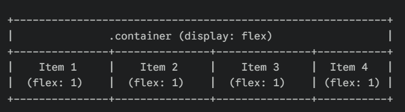
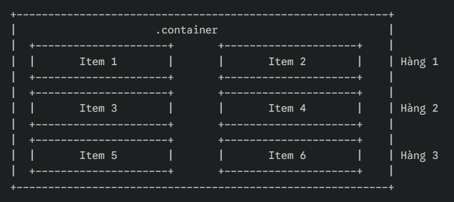
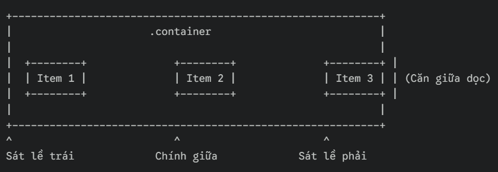
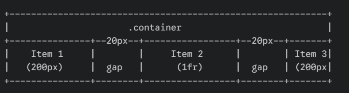
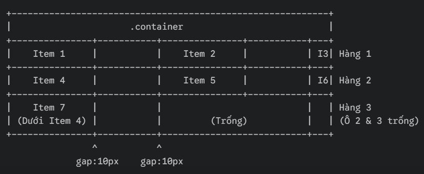

# PHẦN A
## Câu A1
| Position | Vẫn chiếm chỗ trong flow?	| Tham chiếu vị trí	| Cuộn theo trang?	| Use case |
| --- | --- | --- | --- | --- |
| Static | Có | Mặc định | Có | Bố cục mặc định các element |
| relative | Có | Vị trí ban đầu (chính nó) | Có | Làm gốc tọa độ cho phần tử con absolute, hoặc dịch chuyển nhẹ mà không làm mất khoảng trống ban đầu|
| absolute | Không (bị tách khỏi flow) | Phần tử cha gần nhất có position khác static | Có | Làm tooltip, dropdown menu, icon thông báo đè lên ảnh, pop-up|
| fixed	| Không (bị tách khỏi flow)	| Khung hình trình duyệt (Viewport)	| Không (đứng yên một chỗ) | Thanh điều hướng (Navbar) cố định ở top, nút "Back to top", chat widget góc màn hình|
|sticky | Có (khi chưa đạt ngưỡng) | Biên của vùng chứa (container) hoặc viewport | Có (di chuyển theo trang đến khi chạm ngưỡng cấu hình) | Thanh header cuộn xuống đến đỉnh trang thì dính lại, mục lục (sidebar) chạy dọc theo bài viết|

## Câu A2
Trả lời câu hỏi phụ

### Khi nào `absolute` tham chiếu `body`?
Phần tử có `position: absolute` sẽ tham chiếu đến `body` khi tất cả các phần tử cha bao bọc nó đều có `position: static` (hoặc không khai báo `position`)  

### Khi nào `absolute` tham chiếu `parent`?
Nó sẽ tham chiếu đến phần tử cha (`parent`) trực tiếp của nó khi phần tử cha đó được thiết lập một thuộc tính position` khác `static` (thường dùng nhất là `position: relative`, hoặc `absolute`, `fixed`)  

### Giải thích khái niệm "nearest positioned ancestor"
Positioned ancestor: Là một phần tử tổ tiên (cha, ông, cố...) có thuộc tính `position` mang giá trị khác với mặc định (`static`), ví dụ như `relative`, `absolute`, `fixed`, hoặc `sticky`.
Nearest: Nghĩa là gần nhất tính từ phần tử hiện tại ngược lên trên cây DOM

## Câu A2 (10đ) — Flexbox vs Grid

### Trường hợp 1

#### Mã nguồn
```css
/* Trường hợp 1 */
.container { display: flex; }
.item { flex: 1; }
/* 4 items -> Bố cục = ??? */
```

Dự đoán Layout
display: flex mặc định sắp xếp các item theo hàng ngang (flex-direction: row) và không xuống hàng (flex-wrap: nowrap).

flex: 1 viết tắt cho flex-grow: 1, ép cả 4 items chia đều khoảng trống của container theo tỷ lệ bằng nhau (mỗi item chiếm đúng 25% chiều rộng container).



### Trường hợp 2

```css
/* Trường hợp 2 */
.container { display: flex; flex-wrap: wrap; }
.item { width: 45%; margin: 2.5%; }
/* 6 items -> Bố cục = ??? (mấy hàng, mấy cột?) */
```

Dự đoán Layout
- Mỗi item chiếm diện tích tổng cộng theo chiều ngang là: width (45%) + margin-left (2.5%) + margin-right (2.5%) = 50%
- Do có flex-wrap: wrap, khi tổng chiều ngang vượt quá 100%, các item tiếp theo sẽ tự động nhảy xuống hàng mới
- Một hàng chứa vừa vặn đúng 2 items (50% * 2 = 100%). Với tổng số 6 items, bố cục sẽ hiển thị thành 3 hàng và 2 cột.



### Trường hợp 3

```css
/* Trường hợp 3 */
.container { display: flex; justify-content: space-between; align-items: center; }
/* 3 items -> Bố cục = ??? */
```

Dự đoán Layout
- justify-content: space-between đẩy Item 1 sát lề trái, Item 3 sát lề phải. Item 2 nằm chính giữa. Khoảng cách giữa các item bằng nhau.

- align-items: center căn chỉnh tất cả các item nằm chính giữa theo trục dọc (trục phụ) của container.



### Trường hợp 4

```css
/* Trường hợp 4 */
.container { display: grid; grid-template-columns: 200px 1fr 200px; gap: 20px; }
/* 3 items -> Bố cục = ??? */
```

Dự đoán Layout
- Chia thành 3 cột rõ rệt trên 1 hàng.
- Cột 1 và cột 3 cố định độ rộng 200px. Cột 2 (ở giữa) sử dụng 1fr nên sẽ tự động co giãn ôm trọn toàn bộ khoảng không gian còn lại ở giữa.
- Giữa các cột có một khoảng trống (khoảng đệm) rộng 20px nhờ thuộc tính gap.



### Trường hợp 4

```css
/* Trường hợp 5 */
.container { display: grid; grid-template-columns: repeat(3, 1fr); gap: 10px; }
/* 7 items -> Bố cục = ??? (mấy hàng? item cuối ở đâu?) */
```

Dự đoán Layout
- grid-template-columns: repeat(3, 1fr) chia bố cục thành 3 cột bằng nhau, mỗi cột chiếm 1fr (~33.33%).
- Với 7 items, Grid sẽ tự động tính toán số hàng: 7 / 3 = 2 dư 1 -> Tổng cộng có 3 hàng.
- Hàng 1 chứa Item 1, 2, 3. Hàng 2 chứa Item 4, 5, 6.
- Item cuối cùng (Item 7) nằm ở hàng thứ 3 và đặt ngay vị trí của cột đầu tiên (bên dưới Item 4). Hai ô lưới còn lại của hàng 3 sẽ để trống.



# PHAN B