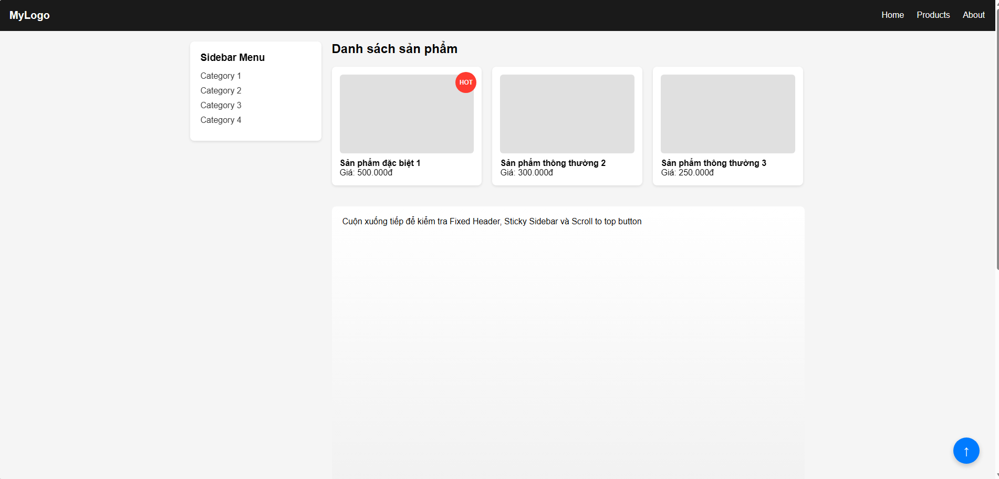
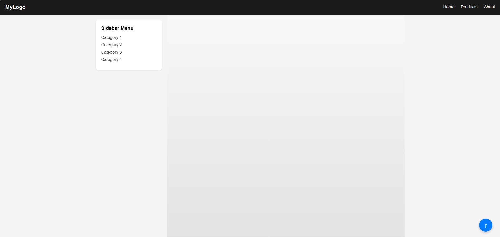
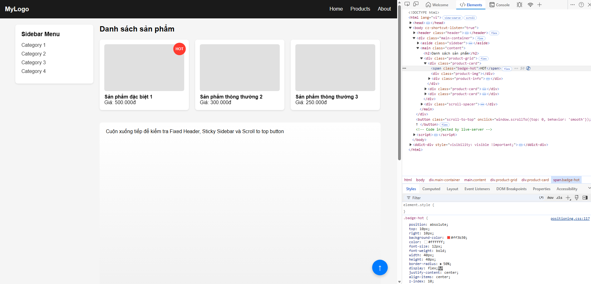
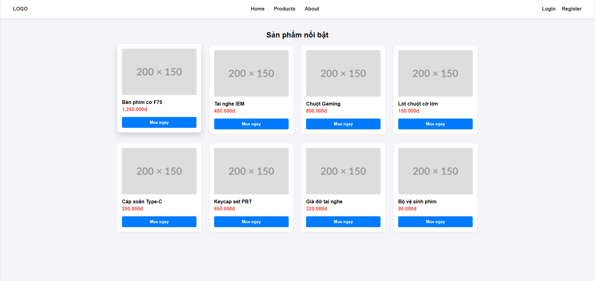
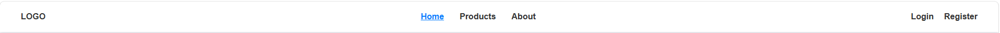
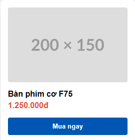
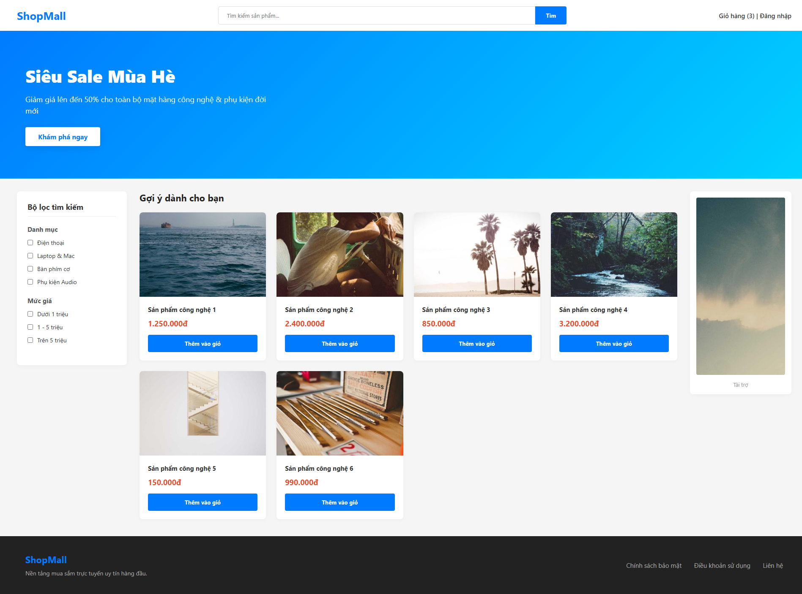

# PHẦN A
## Câu A1
| Position | Vẫn chiếm chỗ trong flow?	| Tham chiếu vị trí	| Cuộn theo trang?	| Use case |
| --- | --- | --- | --- | --- |
| Static | Có | Mặc định | Có | Bố cục mặc định các element |
| relative | Có | Vị trí ban đầu (chính nó) | Có | Làm gốc tọa độ cho phần tử con absolute, hoặc dịch chuyển nhẹ mà không làm mất khoảng trống ban đầu|
| absolute | Không (bị tách khỏi flow) | Phần tử cha gần nhất có position khác static | Có | Làm tooltip, dropdown menu, icon thông báo đè lên ảnh, pop-up|
| fixed	| Không (bị tách khỏi flow)	| Khung hình trình duyệt (Viewport)	| Không (đứng yên một chỗ) | Thanh điều hướng (Navbar) cố định ở top, nút "Back to top", chat widget góc màn hình|
|sticky | Có (khi chưa đạt ngưỡng) | Biên của vùng chứa (container) hoặc viewport | Có (di chuyển theo trang đến khi chạm ngưỡng cấu hình) | Thanh header cuộn xuống đến đỉnh trang thì dính lại, mục lục (sidebar) chạy dọc theo bài viết|

## Câu A2
Trả lời câu hỏi phụ

### Khi nào `absolute` tham chiếu `body`?
Phần tử có `position: absolute` sẽ tham chiếu đến `body` khi tất cả các phần tử cha bao bọc nó đều có `position: static` (hoặc không khai báo `position`)  

### Khi nào `absolute` tham chiếu `parent`?
Nó sẽ tham chiếu đến phần tử cha (`parent`) trực tiếp của nó khi phần tử cha đó được thiết lập một thuộc tính position` khác `static` (thường dùng nhất là `position: relative`, hoặc `absolute`, `fixed`)  

### Giải thích khái niệm "nearest positioned ancestor"
Positioned ancestor: Là một phần tử tổ tiên (cha, ông, cố...) có thuộc tính `position` mang giá trị khác với mặc định (`static`), ví dụ như `relative`, `absolute`, `fixed`, hoặc `sticky`.
Nearest: Nghĩa là gần nhất tính từ phần tử hiện tại ngược lên trên cây DOM

## Câu A2 (10đ) — Flexbox vs Grid

### Trường hợp 1

#### Mã nguồn
```css
/* Trường hợp 1 */
.container { display: flex; }
.item { flex: 1; }
/* 4 items -> Bố cục = ??? */
```

Dự đoán Layout
display: flex mặc định sắp xếp các item theo hàng ngang (flex-direction: row) và không xuống hàng (flex-wrap: nowrap).

flex: 1 viết tắt cho flex-grow: 1, ép cả 4 items chia đều khoảng trống của container theo tỷ lệ bằng nhau (mỗi item chiếm đúng 25% chiều rộng container).


### Trường hợp 2

```css
/* Trường hợp 2 */
.container { display: flex; flex-wrap: wrap; }
.item { width: 45%; margin: 2.5%; }
/* 6 items -> Bố cục = ??? (mấy hàng, mấy cột?) */
```

Dự đoán Layout
- Mỗi item chiếm diện tích tổng cộng theo chiều ngang là: width (45%) + margin-left (2.5%) + margin-right (2.5%) = 50%
- Do có flex-wrap: wrap, khi tổng chiều ngang vượt quá 100%, các item tiếp theo sẽ tự động nhảy xuống hàng mới
- Một hàng chứa vừa vặn đúng 2 items (50% * 2 = 100%). Với tổng số 6 items, bố cục sẽ hiển thị thành 3 hàng và 2 cột.


### Trường hợp 3

```css
/* Trường hợp 3 */
.container { display: flex; justify-content: space-between; align-items: center; }
/* 3 items -> Bố cục = ??? */
```

Dự đoán Layout
- justify-content: space-between đẩy Item 1 sát lề trái, Item 3 sát lề phải. Item 2 nằm chính giữa. Khoảng cách giữa các item bằng nhau.

- align-items: center căn chỉnh tất cả các item nằm chính giữa theo trục dọc (trục phụ) của container.


### Trường hợp 4

```css
/* Trường hợp 4 */
.container { display: grid; grid-template-columns: 200px 1fr 200px; gap: 20px; }
/* 3 items -> Bố cục = ??? */
```

Dự đoán Layout
- Chia thành 3 cột rõ rệt trên 1 hàng.
- Cột 1 và cột 3 cố định độ rộng 200px. Cột 2 (ở giữa) sử dụng 1fr nên sẽ tự động co giãn ôm trọn toàn bộ khoảng không gian còn lại ở giữa.
- Giữa các cột có một khoảng trống (khoảng đệm) rộng 20px nhờ thuộc tính gap.


### Trường hợp 4

```css
/* Trường hợp 5 */
.container { display: grid; grid-template-columns: repeat(3, 1fr); gap: 10px; }
/* 7 items -> Bố cục = ??? (mấy hàng? item cuối ở đâu?) */
```

Dự đoán Layout
- grid-template-columns: repeat(3, 1fr) chia bố cục thành 3 cột bằng nhau, mỗi cột chiếm 1fr (~33.33%).
- Với 7 items, Grid sẽ tự động tính toán số hàng: 7 / 3 = 2 dư 1 -> Tổng cộng có 3 hàng.
- Hàng 1 chứa Item 1, 2, 3. Hàng 2 chứa Item 4, 5, 6.
- Item cuối cùng (Item 7) nằm ở hàng thứ 3 và đặt ngay vị trí của cột đầu tiên (bên dưới Item 4). Hai ô lưới còn lại của hàng 3 sẽ để trống.


# PHAN B

## Câu B1







## Câu B2







## Câu B3



# PHẦN C

## Câu C1 — Flexbox vs Grid: Khi nào dùng gì?

### 1. Navigation bar ngang (logo + menu + buttons)
* **Lựa chọn:** **Flexbox**
* **Giải thích:** Thanh điều hướng ngang là tập hợp các phần tử sắp xếp theo một chiều duy nhất (trục ngang). Flexbox xử lý cực tốt việc căn giữa theo chiều dọc (`align-items: center`) và phân bổ khoảng cách linh hoạt giữa các cụm phần tử (`justify-content: space-between`).

### 2. Lưới ảnh Instagram (3 cột đều nhau, số ảnh không biết trước)
* **Lựa chọn:** **Grid**
* **Giải thích:** Đây là bố cục dạng lưới 2 chiều (hàng và cột) cố định. Việc sử dụng CSS Grid với cấu hình `grid-template-columns: repeat(3, 1fr)` sẽ tự động tính toán tạo ra 3 cột bằng nhau, và khi số lượng ảnh tăng lên không giới hạn, các ảnh mới sẽ tự động nhảy xuống hàng tiếp theo một cách thẳng hàng, vuông vức mà không lo bị lệch dòng.

### 3. Layout blog: main content + sidebar
* **Lựa chọn:** **Grid** (hoặc **Flexbox** đều được, nhưng tối ưu nhất cho khung lớn là **Grid**)
* **Giải thích:** Đây là layout tổng thể của trang web (Macro Layout). Sử dụng CSS Grid giúp thiết lập hệ thống cột rõ ràng ngay từ đầu (ví dụ: `grid-template-columns: 1fr 300px`), quản lý khoảng cách bằng `gap` trực quan và giúp cấu trúc bố cục trang web mạch lạc, không bị phụ thuộc vào kích thước nội dung bên trong.

### 4. Footer với 4 cột thông tin (Về chúng tôi, Liên kết, Hỗ trợ, Liên hệ)
* **Lựa chọn:** **Grid** hoặc **Flexbox** (Kết hợp cả hai là tốt nhất)
* **Giải thích:** * Nên dùng **Grid** cho phần bao ngoài của Footer để chia đều khung thành 4 cột cố định một cách nhanh chóng (`grid-template-columns: repeat(4, 1fr)`).
  * Bên trong từng cột thông tin nhỏ, có thể dùng **Flexbox** theo chiều dọc (`flex-direction: column`) để quản lý danh sách các thẻ liên kết đi kèm.

### 5. Card sản phẩm (ảnh trên, text giữa, nút dưới — nút luôn dính đáy)
* **Lựa chọn:** **Flexbox**
* **Giải thích:** Cấu trúc bên trong của một card sản phẩm đi theo một chiều duy nhất từ trên xuống dưới (trục dọc). Khi thiết lập `display: flex; flex-direction: column;` cho card, ta chỉ cần thêm thuộc tính `margin-top: auto;` cho nút bấm ở dưới cùng. Cơ chế của Flexbox sẽ tự động đẩy nút bấm bám chặt vào đáy card một cách hoàn hảo, bất kể phần text ở giữa dài hay ngắn.

## Câu C2

### Lỗi 1: Cards không đều chiều cao — nút "Mua" bị nhảy lên/xuống

#### Nguyên nhân
* Mặc định, các phần tử con (`.card`) trong một flex container (`.card-container`) sẽ có chiều cao bằng nhau nhờ thuộc tính `align-items: stretch`. 
* Tuy nhiên, bản thân bên trong mỗi `.card` chưa được thiết lập cơ chế Flexbox. Khi tiêu đề (`h3`) hoặc nội dung của các card dài ngắn khác nhau, các thẻ con bên trong sẽ tự sắp xếp theo dòng chảy thông thường, dẫn đến việc nút `.btn` bị đẩy lên hoặc hạ xuống không đồng đều.

#### Code sửa
Biến `.card` thành một flex container theo trục dọc (`flex-direction: column`) và dùng thuộc tính `margin-top: auto` cho nút bấm để ép nó luôn dính chặt vào đáy card.

```css
.card-container { 
    display: flex; 
    flex-wrap: wrap; 
}
.card { 
    width: 30%; 
    margin: 1.5%; 
    display: flex;
    flex-direction: column;
}
.card img { width: 100%; }
.card h3 { font-size: 18px; }
.card .btn { 
    padding: 10px; 
    margin-top: auto;
}
```

### Lỗi 2: Muốn items nằm giữa cả ngang lẫn dọc trong container 100vh, nhưng item vẫn dính góc trái trên

#### Nguyên nhân
- Thuộc tính `text-align: center` cấu hình ở phần tử con `.hero-content` chỉ có tác dụng căn giữa các nội dung dạng văn bản (`inline/inline-block element`) nằm bên trong chính nó, chứ không có tác dụng căn chỉnh vị trí của khối `.hero-content` so với cha.

- Mặc dù phần tử cha `.hero` đã có `display: flex`, nhưng chưa hề khai báo các thuộc tính căn chỉnh vị trí của Flexbox cho các phần tử con dọc theo trục chính và trục phụ. Do đó, các item bên trong mặc định bị xếp ở góc trên bên trái (`flex-start`).

#### Code sửa
Bổ sung cặp thuộc tính `justify-content: center` (căn giữa theo chiều ngang) và `align-items: center` (căn giữa theo chiều dọc) vào phần tử cha `.hero`
```css
.hero {
    height: 100vh;
    display: flex;
    justify-content: center;
    align-items: center;
}
.hero-content {
    text-align: center;
}
```

### Lỗi 3: Sidebar bị co lại khi content quá dài

#### Nguyên nhân
Trong cơ chế của Flexbox, các flex items mặc định đều có thuộc tính `flex-shrink: 1`. Thuộc tính này cho phép phần tử tự động co hẹp kích thước lại nhỏ hơn giá trị width định sẵn nếu không gian tổng thể của container bị thiếu.

Khi khối `.content` có nội dung quá dài hoặc sử dụng `flex: 1` để chiếm trọn không gian, nó sẽ tạo áp lực ép không gian của toàn bộ dòng, khiến `.sidebar` bị co lại nhỏ hơn mức 250px đã cấu hình ban đầu.

#### Code sửa
Đặt thuộc tính flex-shrink: 0 cho `.sidebar` để ép nó giữ nguyên kích thước cố định, tuyệt đối không bị co lại trong bất kỳ tình huống nào

```css
.layout { display: flex; }
.sidebar { 
    width: 250px; 
    /* Sửa tại đây: Ngăn sidebar bị co lại */
    flex-shrink: 0;
}
.content { flex: 1; }
```