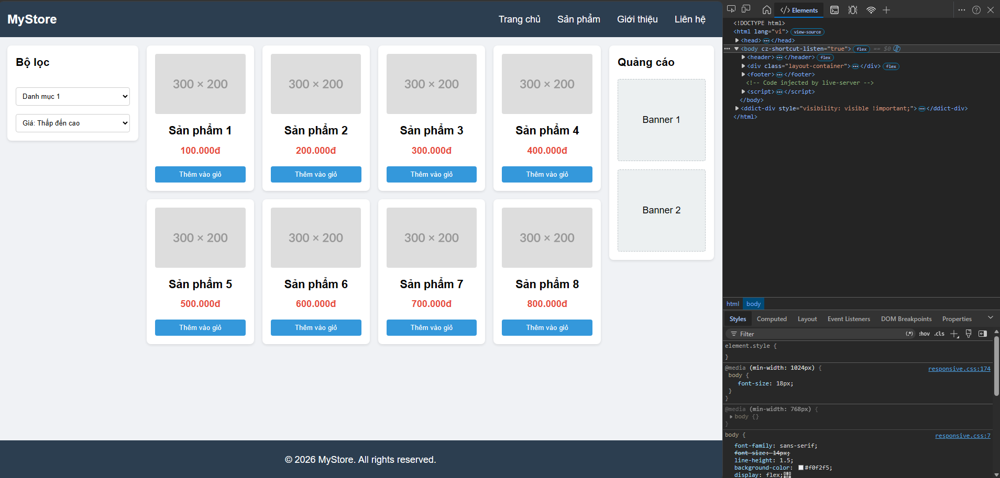
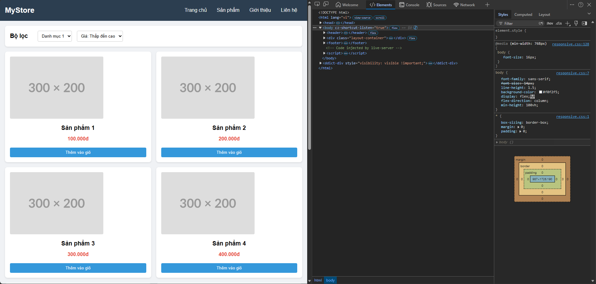
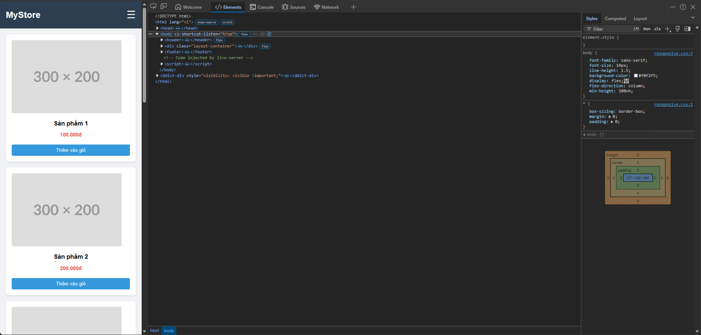
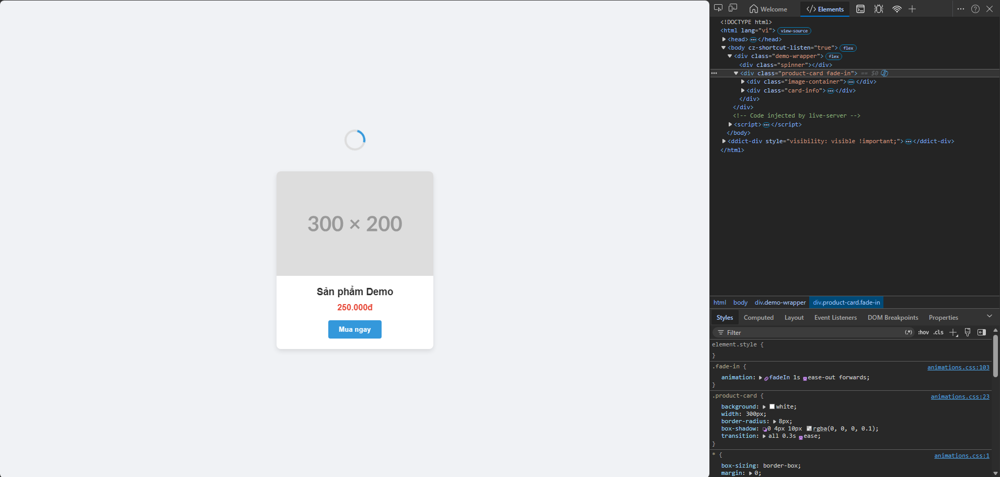
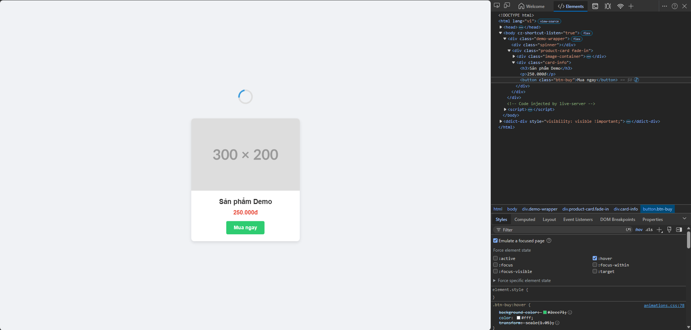
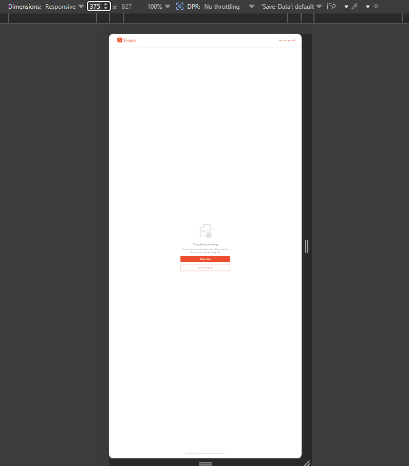
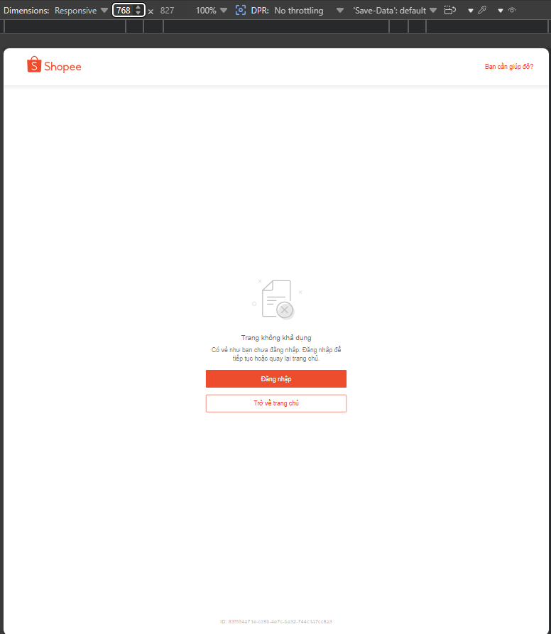
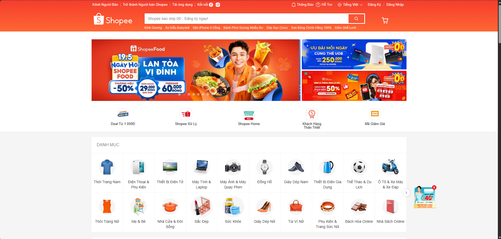

# PHẦN A

## CÂU A1

1. `<meta name="viewport" content="width=device-width, initial-scale=1.0">`  
* `width=device-width`: Yêu cầu trình duyệt render chiều rộng trang web bằng đúng chiều rộng vật lý của màn hình thiết bị  
* `initial-scale=1.0`: Đặt mức độ thu phóng (zoom) ban đầu là 100% khi trang vừa tải xong

2. Thiếu dòng này: iPhone giả định trang rộng 980px (như desktop) → thu nhỏ lại → chữ bé xíu → UX tệ.

3. Khác nhau:
* Mobile-First: Viết CSS mặc định cho giao diện màn hình nhỏ (Mobile) trước. Sau đó dùng `@media (min-width)` để bổ sung layout/style cho các màn hình lớn dần (Tablet, Desktop)

* Desktop-First: Viết CSS mặc định cho giao diện màn hình lớn (PC) trước. Sau đó dùng `@media (max-width)` để điều chỉnh và ghi đè layout khi màn hình nhỏ lại

```css
/* --- Mobile-First --- */
.product-item { width: 100%; } /* Mặc định Mobile: 1 cột */

@media (min-width: 768px) {
  .product-item { width: 50%; } /* Từ Tablet trở lên: 2 cột */
}

/* --- Desktop-First --- */
.product-item { width: 50%; } /* Mặc định Desktop: 2 cột */

@media (max-width: 767.98px) {
  .product-item { width: 100%; } /* Dưới Tablet (Mobile): 1 cột */
}
```

**Tại sao Mobile-First được khuyên dùng?** 

* Hiệu suất: Thiết bị di động (vốn yếu hơn) sẽ chỉ tải và đọc các đoạn CSS nhẹ nhàng cốt lõi, không phải mất tài nguyên phân tích các đoạn CSS phức tạp của Desktop rồi mới tiến hành ghi đè.
* Trải nghiệm người dùng (UX): Buộc lập trình viên phải ưu tiên sắp xếp các tính năng và nội dung quan trọng nhất trong không gian chật hẹp, tránh nhồi nhét.

## CÂU A2

1. **Extra small (xs)**
* Kích thước: < 576px
* Thiết bị đại diện: Điện thoại di động (Mobile cầm dọc - Portrait).
* Ví dụ hiển thị lưới sản phẩm: 1 cột (100% width).

2. **Small (sm)**
* Kích thước: >= 576px
* Thiết bị đại diện: Điện thoại cầm ngang (Mobile landscape) hoặc Tablet nhỏ.
* Ví dụ hiển thị lưới sản phẩm: 2 cột.

3. **Medium (md)**
* Kích thước: >= 768px
* Thiết bị đại diện: Máy tính bảng (Tablet - iPad).
* Ví dụ hiển thị lưới sản phẩm: 2 hoặc 3 cột.

4. **Large (lg)**
* Kích thước: >= 992px
* Thiết bị đại diện: Laptop, màn hình Desktop vừa.
* Ví dụ hiển thị lưới sản phẩm: 3 hoặc 4 cột.

5. **Extra large (xl) / Extra extra large (xxl)**
* Kích thước: >= 1200px (xl) và >= 1400px (xxl).
* Thiết bị đại diện: Màn hình Desktop lớn, PC chuyên dụng.
*  Ví dụ hiển thị lưới sản phẩm: 4 đến 6 cột (tùy kích thước sản phẩm).

## Câu A3

| Chiều rộng màn hình | `.container` with | Giải thích chi tiết quy tắc áp dụng
|---|---|---|
| 375px | 100% | Nhỏ hơn 576px, nhận giá trị CSS mặc định ban đầu|
|600px |540px|	Thỏa mãn điều kiện >= 576px nhưng chưa đạt tới 768px|
|800px	|720px|	Thỏa mãn điều kiện >= 768px nhưng chưa đạt tới 992px|
|1000px	|960px|	Thỏa mãn điều kiện >= 992px nhưng chưa đạt tới 1200px|
|1400px	|1140px|Lớn hơn mốc cuối cùng >= 1200px, nhận giá trị lớn nhất|

## CÂU A4

1. **Giải thích 4 tính năng chính của SCSS và ví dụ**
* Variables (Biến): Lưu trữ các giá trị (màu sắc, font, size) để tái sử dụng ở nhiều nơi và dễ cập nhật đồng loạt.
```scss
$primary-color: #007bff;
.button { background-color: $primary-color; }
```
* Nesting (Lồng nhau): Cho phép viết các bộ chọn (selectors) lồng nhau theo đúng cấu trúc hình cây của HTML, giúp code tường minh, dễ quản lý.
```scss
nav {
  background: #333;
  ul { list-style: none; }
  a { text-decoration: none; }
}
```
* Mixins: Gom một nhóm các thuộc tính CSS lại thành một khối. Có thể tái sử dụng thông qua từ khóa `@include` và truyền tham số linh hoạt như một hàm
```scss
@mixin flex-center {
  display: flex;
  justify-content: center;
  align-items: center;
}
.box { @include flex-center; }
```
* @extend / Inheritance (Kế thừa): Cho phép một selector thừa hưởng lại toàn bộ các thuộc tính đã viết của một selector khác, tránh lặp lại mã nguồn (DRY).
```scss
.alert-box { padding: 15px; border: 1px solid #ccc; }
.alert-danger {
  @extend .alert-box;
  border-color: red; /* Chỉ viết thêm thuộc tính khác biệt */
}
```

**Tại sao trình duyệt KHÔNG đọc được file .scss? Cần bước gì?**
- Do Trình duyệt web (Chrome, Edge, Firefox, Safari,...) chỉ có công cụ phân dịch và đọc hiểu duy nhất ngôn ngữ CSS tiêu chuẩn. SCSS là ngôn ngữ tiền xử lý (CSS Preprocessor) sở hữu các cú pháp nâng cao (biến, hàm, lồng nhau) mà trình duyệt không có khả năng tự giải mã.
- Giải pháp/Bước chuyển đổi: Cần chạy qua một bước gọi là Biên dịch (Compile). Lập trình viên sử dụng các công cụ như extension Live Sass Compiler trên VS Code, hoặc các thư viện Node-Sass/Dart-Sass để dịch toàn bộ mã từ file `.scss` thành file `.css` thuần. Sau đó, nhúng file `.css` đã biên dịch này vào file HTML qua thẻ `<link>`.

# PHẦN B

## CÂU B1







## CÂU B2





## CÂU B3

### Lệnh biên dịch SCSS sang CSS
```scss
Để biên dịch file `style.scss` trong thư mục `scss` ra file `style.css` ở thư mục gốc, sử dụng lệnh sau (yêu cầu đã cài đặt Dart Sass hoặc Node Sass):

```bash
sass scss/style.scss style.css
```

# PHẦN C

## Câu C1 (10đ) — Phân tích trang web thực tế: Shopee (shopee.vn)

**1. Hình ảnh hiển thị trên 3 kích thước màn hình**

* **Mobile (375px):**  
    
* **Tablet (768px):**  
    
* **Desktop (1440px):**  
    


**2. Phân tích chi tiết sự thay đổi giao diện**

* **Navigation (Điều hướng) thay đổi thế nào?**
  * Desktop (1440px): Thanh header rất rộng, hiển thị đầy đủ thanh tìm kiếm lớn, giỏ hàng, và một loạt các text links điều hướng phụ (Kênh Người Bán, Tải ứng dụng, Kết nối, Thông báo...).
  * Tablet (768px): Header bắt đầu thu gọn lại, khoảng cách giữa các element hẹp hơn. Một số link text phụ trên cùng có thể bị ẩn đi để nhường chỗ cho thanh tìm kiếm.
  * Mobile (375px): Thay đổi hoàn toàn (thường chuyển hướng sang giao diện web-app mobile). Khung tìm kiếm bị thu ngắn tối đa. Xuất hiện Bottom Navigation Bar (Thanh điều hướng dưới đáy màn hình) chứa các icon chính (Home, Mall, Live, Tôi) thay thế cho thanh menu ngang phía trên. Không dùng hamburger menu truyền thống mà dùng icon trực quan.

* **Lưới content (Product Grid) thay đổi mấy cột?**
  * Desktop (1440px): Lưới sản phẩm (Gợi ý hôm nay) dàn trải thành 6 cột (width khoảng 16.66%).
  * Tablet (768px): Lưới sản phẩm co lại còn khoảng 3 - 4 cột để đảm bảo thẻ sản phẩm không bị quá nhỏ.
  * Mobile (375px): Lưới sản phẩm thu về 2 cột (width 50%), hình ảnh sản phẩm chiếm trọn chiều ngang của cột để tối ưu điểm chạm (touch target) cho ngón tay.

* **Elements nào bị ẩn (Hidden) trên mobile?**
  * Banner quảng cáo dạng carousel rộng ở trang chủ bị thu nhỏ tỉ lệ hoặc thay bằng banner dọc.
  * Danh mục sản phẩm (Categories) dạng lưới icon lớn trên Desktop bị ẩn hoặc chuyển thành dạng thanh cuộn ngang (horizontal scroll) gạt bằng tay.
  * Toàn bộ phần Footer chứa các cột links (Chăm sóc khách hàng, Về Shopee, Thanh toán, Vận chuyển...) thường bị ẩn gọn vào trong các thẻ Accordion (nhấn vào dấu `+` hoặc `v` mới xổ ra) để tiết kiệm không gian chiều dọc.
  * Các mã QR code tải app bị ẩn hoàn toàn (vì đang dùng trên mobile rồi).

* **Font size có thay đổi không?**
  * Có thay đổi đáng kể. Trên Desktop, Shopee sử dụng font chữ tương đối nhỏ (12px - 14px) để nhồi nhét được nhiều thông tin, mô tả, nhãn dán. 
  * Khi xuống Mobile, font size gốc (`html`, `body`) thường được giữ nguyên hoặc tăng nhẹ, nhưng các thẻ Heading (`h1`, `h2`) sẽ bị giảm kích thước xuống để không bị rớt dòng. Chữ ở tên sản phẩm trên Mobile (2 cột) thực tế nhìn sẽ to và rõ ràng hơn so với tổng thể diện tích màn hình so với Desktop.

**3. Media Queries thực tế trên DevTools**

Không thể tìm thấy `@media` trên trang shopee.vn


## Câu C2

### 1. Phân tích & Wireframe (Sơ đồ bố cục)

Dưới đây là sơ đồ bố cục (Wireframe) mô phỏng dạng text và chiến lược Responsive cho từng kích thước thiết bị:

**Mobile (< 768px)**
* **Sơ đồ:**
    ```text
    [ HEADER: Logo | Icon Gọi điện ]
    [ HERO IMAGE (Full width) ]
    [ FOOD GRID (2 Cột ảnh) ]
    [ FORM ĐẶT BÀN ]
    [ GOOGLE MAPS ]
    [ FOOTER ]
    ```
* **Trả lời yêu cầu:**
    * **Những gì bị ẩn?** Chữ số điện thoại ở Header (chỉ để lại Icon điện thoại để tiết kiệm không gian), thanh menu ngang (nếu có) ẩn vào nút Hamburger.
    * **Form nằm đâu?** Nằm ngay dưới khối Lưới ảnh món ăn. Dàn toàn bộ 100% chiều ngang để người dùng dễ chạm và nhập liệu trên điện thoại.

**Tablet (768px - 1023px)**
* **Sơ đồ:**
    ```text
    [ HEADER: Logo | Số điện thoại ]
    [ HERO IMAGE (Full width) ]
    [ FOOD GRID (3 Cột ảnh) ]
    [ FORM ĐẶT BÀN ] | [ GOOGLE MAPS ]  <-- Chia đôi 2 cột ngang nhau
    [ FOOTER ]
    ```
* **Trả lời yêu cầu:**
    * **Grid ảnh mấy cột?** 3 cột (2 hàng x 3 ảnh = 6 ảnh).
    * **Bản đồ nằm đâu?** Nằm song song bên cạnh Form đặt bàn (chia màn hình 50-50). Tận dụng lợi thế chiều ngang của màn hình Tablet để giảm bớt độ dài trang khi cuộn.

**Desktop (>= 1024px)**
* **Sơ đồ:**
    ```text
    [ HEADER: Logo | Menu | Số điện thoại ]
    [ HERO IMAGE (Full width) ]
    -----------------------------------------
    | MAIN CONTENT          | SIDEBAR       |
    | - FOOD GRID (3 Cột)   | - FORM ĐẶT BÀN|
    | - GOOGLE MAPS         |   (Sticky)    |
    -----------------------------------------
    [ FOOTER ]
    ```
* **Trả lời yêu cầu:**
    * **Layout bao nhiêu cột?** Layout chính chia làm 2 cột bất đối xứng (Ví dụ: Main chiếm tỉ lệ 2 phần, Sidebar chiếm 1 phần).
    * **Sidebar có không?** **Có.** Đưa Form đặt bàn sang bên phải làm một Sidebar dính (Sticky Sidebar). Khi người dùng cuộn xuống xem ảnh món ăn hoặc bản đồ, Form luôn trượt theo trên màn hình để kích thích hành vi đặt bàn ngay lập tức.

### 2. CSS Skeleton (Grid + Mobile-First)

Đoạn code khung (skeleton) dưới đây sử dụng CSS Grid và Media Queries theo chuẩn Mobile-First để xử lý layout đã phân tích ở trên:

```css
.restaurant-layout {
    display: grid;
    grid-template-columns: 1fr;
    gap: 20px;
}

.food-grid {
    display: grid;
    grid-template-columns: repeat(2, 1fr);
    gap: 10px;
}

@media (min-width: 768px) {
    .food-grid {
        grid-template-columns: repeat(3, 1fr);
    }

    .form-map-wrapper {
        display: grid;
        grid-template-columns: 1fr 1fr;
        gap: 20px;
    }
}

@media (min-width: 1024px) {
    .restaurant-layout {
        grid-template-columns: 2fr 1fr;
        grid-template-areas:
            "header header"
            "hero hero"
            "main-content sidebar"
            "footer footer";
    }

    .header { grid-area: header; }
    .hero { grid-area: hero; }
    .footer { grid-area: footer; }
    
    .main-content { grid-area: main-content; }
    
    .booking-form {
        grid-area: sidebar;
        position: sticky;
        top: 20px;
    }

    .form-map-wrapper {
        display: block; 
    }
}
```