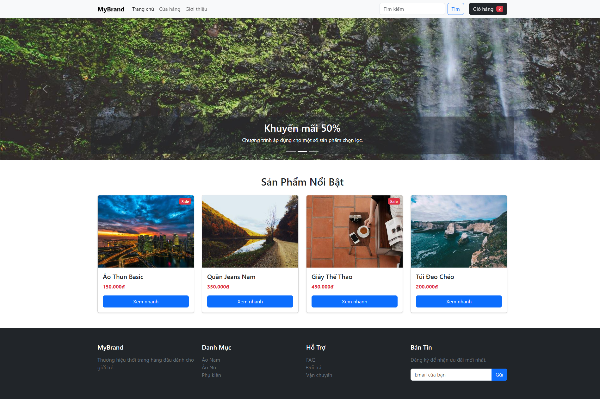
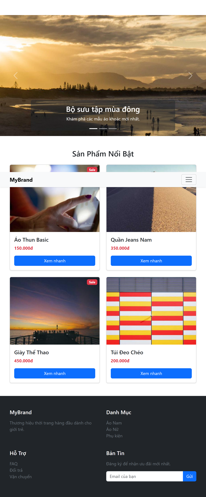
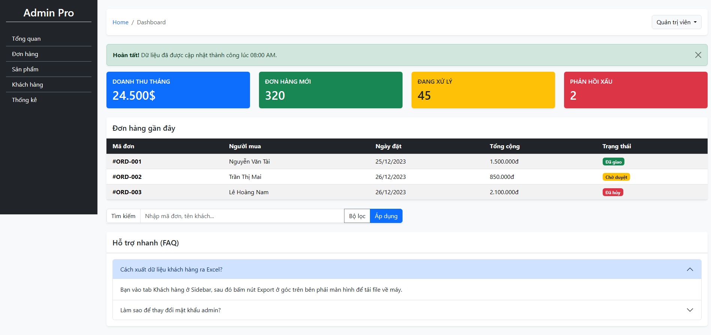
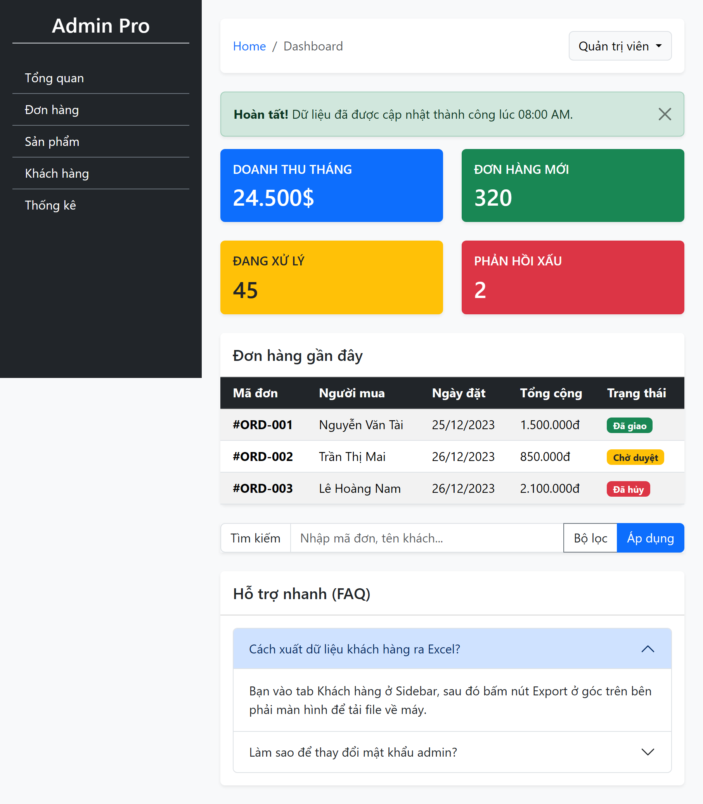
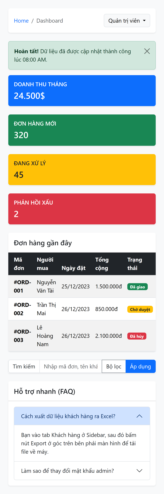

# TRACK A — BOOTSTRAP 5

# PHẦN A

## Câu A1

**1. Bảng Grid Layout:**

| Kích thước | < 768px (xs, sm) | 768px - 991px (md) | ≥ 992px (lg, xl, xxl) |
| :--- | :--- | :--- | :--- |
| **Số cột** | 1 cột / dòng | 2 cột / dòng | 4 cột / dòng |
| **Box layout** | Xếp dọc (Mỗi box chiếm 100% chiều rộng) | Lưới 2x2 (Mỗi box chiếm 50% chiều rộng) | Nằm ngang 1 dòng (Mỗi box chiếm 25% chiều rộng) |

**2. Trả lời câu hỏi thêm:**
* `col-md-6` Nghĩa là từ kích thước màn hình Medium (`md` - ≥ 768px) trở lên, phần tử sẽ chiếm 6 phần trên tổng số 12 phần của Grid (tương đương 50% chiều rộng).
* không cần viết `col-sm-12` vì Bootstrap thiết kế theo nguyên tắc "Mobile-first". Class `col-12` (không có tiền tố kích thước) sẽ áp dụng mặc định cho kích thước màn hình nhỏ nhất trở lên. Nếu ở breakpoint `sm` (≥ 576px) bạn vẫn muốn nó chiếm 12 cột thì không cần viết thêm gì cả, nó sẽ tự động kế thừa thuộc tính của `col-12`. Việc viết thêm `col-sm-12` là dư thừa.

## Câu A2

**1. Giải thích class `d-none d-md-block`:**
* Ẩn trên các màn hình nhỏ hơn `md` (dưới 768px) do class `d-none` (ẩn phần tử từ kích thước nhỏ nhất).
* Hiển thị dưới dạng khối (block) trên các màn hình từ `md` trở lên (≥ 768px) do class `d-md-block` ghi đè lên `d-none`.

**2. Liệt kê 5 spacing utilities:**
* `mt-3`: Thêm khoảng cách lề bên trên (Margin Top) ở mức độ 3.
* `px-4`: Thêm vùng đệm ở hai bên trái phải (Padding X-axis) ở mức độ 4.
* `mb-auto`: Đặt khoảng cách lề bên dưới (Margin Bottom) là tự động (thường dùng để đẩy phần tử trong Flexbox).
* `py-2`: Thêm vùng đệm ở bên trên và bên dưới (Padding Y-axis) ở mức độ 2.
* `ms-5`: Thêm khoảng cách lề bên trái (Margin Start - từ bản BS5 thay cho ml) ở mức độ 5.

**3. Sự khác nhau giữa `.container`, `.container-fluid`, `.container-md`:**
* `.container`: Căn giữa nội dung, có `max-width` cố định nhưng sẽ thay đổi nhảy bậc tùy theo từng breakpoint của màn hình (sm, md, lg, xl, xxl).
* `.container-fluid`: Luôn luôn kéo giãn chiếm 100% chiều rộng (width: 100%) của khung nhìn ở mọi kích thước màn hình.
* `.container-md`: Chiếm 100% chiều rộng trên các màn hình nhỏ (nhỏ hơn `md`). Khi màn hình đạt từ mức `md` (≥ 768px) trở lên, nó bắt đầu có `max-width` cố định và hoạt động hệt như `.container` bình thường.

# PHẦN B

## Câu B1





## Câu B2







### PHẦN C — PHÂN TÍCH (20 điểm)

#### Câu C1 (10đ) — Tùy biến Bootstrap

**1. Quy trình đổi màu `$primary` sang `#E63946`:**
* **Công cụ cần thiết:** Node.js, Package manager (npm hoặc yarn), và trình biên dịch Sass (như `sass` package hoặc extension Live Sass Compiler trên VS Code).
* **Quy trình và file cần modify:**
    1. Cài đặt Bootstrap qua npm để lấy source code SASS (`npm install bootstrap`).
    2. Tạo một file SASS của riêng bạn, ví dụ `custom.scss`.
    3. Trong file `custom.scss`, khai báo đè biến `$primary` **trước** khi import các file SASS của Bootstrap:
       ```scss
       $primary: #E63946;
       @import "../node_modules/bootstrap/scss/bootstrap";
       ```
    4. Dùng công cụ biên dịch file `custom.scss` này thành file `custom.css` và nhúng file CSS đó vào thẻ `<link>` trong HTML của bạn.

**2. Tại sao KHÔNG nên override trực tiếp `.btn-primary` mà nên dùng SASS variables?**
* Tính đồng bộ toàn hệ thống: Biến `$primary` trong Bootstrap không chỉ dùng cho mỗi `.btn-primary`. Nó được sử dụng để nội suy ra hàng chục class khác như `text-primary`, `bg-primary`, `border-primary`, `alert-primary`, `btn-outline-primary`, và các trạng thái `:hover`, `:active`, `:focus`.
* Nếu bạn đè cứng `.btn-primary { background: red; }`, bạn sẽ phải tự đi tìm và viết tay lại CSS cho tất cả các class và trạng thái liên quan nói trên. Điều này cực kỳ tốn thời gian, dễ gây lỗi sót hiển thị và rất khó bảo trì. Đổi biến SASS sẽ giúp trình biên dịch tự động tính toán lại toàn bộ phổ màu cho bạn.

---

#### Câu C2 (10đ) — So sánh

**Code CSS thuần cho Navbar và Product Card:**

```css
.navbar {
  display: flex;
  justify-content: space-between;
  align-items: center;
  padding: 1rem 2rem;
  background-color: #f8f9fa;
  box-shadow: 0 2px 4px rgba(0,0,0,0.1);
}
.nav-brand {
  font-size: 1.5rem;
  font-weight: bold;
  text-decoration: none;
  color: #333;
}
.nav-links {
  display: flex;
  list-style: none;
  gap: 1.5rem;
  margin: 0;
  padding: 0;
}
.nav-links a {
  text-decoration: none;
  color: #555;
}
.menu-toggle {
  display: none;
  background: none;
  border: none;
  font-size: 1.5rem;
  cursor: pointer;
}
@media (max-width: 768px) {
  .nav-links {
    display: none;
    flex-direction: column;
    position: absolute;
    top: 60px;
    left: 0;
    width: 100%;
    background-color: #f8f9fa;
    padding: 1rem;
  }
  .nav-links.active {
    display: flex;
  }
  .menu-toggle {
    display: block;
  }
}

.card {
  border: 1px solid #dee2e6;
  border-radius: 0.375rem;
  overflow: hidden;
  width: 18rem;
  box-shadow: 0 0.125rem 0.25rem rgba(0,0,0,0.075);
  font-family: sans-serif;
}
.card-img {
  width: 100%;
  height: 200px;
  object-fit: cover;
}
.card-body {
  padding: 1rem;
}
.card-title {
  font-size: 1.25rem;
  margin: 0 0 0.5rem 0;
}
.card-text {
  color: #6c757d;
  margin: 0 0 1rem 0;
}
.btn {
  display: inline-block;
  padding: 0.375rem 0.75rem;
  background-color: #0d6efd;
  color: white;
  text-decoration: none;
  border-radius: 0.375rem;
  text-align: center;
}
```


# TRACK B — TAILWINDCSS

# PHẦN A

## Câu A1

Giải nghĩa các class trong đoạn HTML:

**Thẻ `<div>` ngoài cùng:**
- `flex` -> `display: flex;`
- `items-center` -> `align-items: center;` (Căn giữa các phần tử theo trục chéo/dọc)
- `justify-between` -> `justify-content: space-between;` (Đẩy các phần tử dạt ra hai bên)
- `p-4` -> `padding: 1rem;` (16px)
- `bg-white` -> `background-color: #ffffff;` (Màu nền trắng)
- `shadow-md` -> Bóng đổ cỡ vừa (`box-shadow`)
- `rounded-lg` -> `border-radius: 0.5rem;` (Bo góc 8px)
- `hover:shadow-xl` -> Bóng đổ tăng lên mức lớn (extra large) khi di chuột vào (`:hover`)
- `transition-shadow` -> Thêm hiệu ứng chuyển đổi (`transition`) mượt mà cho thuộc tính box-shadow
- `duration-300` -> `transition-duration: 300ms;` (Thời gian hiệu ứng diễn ra trong 0.3s)

**Thẻ ``:**
- `w-16` -> `width: 4rem;` (64px)
- `h-16` -> `height: 4rem;` (64px)
- `rounded-full` -> `border-radius: 9999px;` (Bo góc tròn hoàn toàn)
- `object-cover` -> `object-fit: cover;` (Ảnh cắt vừa khung hình mà không bị méo tỉ lệ)

**Thẻ `<div>` bọc text:**
- `ml-4` -> `margin-left: 1rem;` (16px)
- `flex-1` -> `flex: 1 1 0%;` (Cho phép phần tử giãn ra chiếm toàn bộ không gian trống còn lại trong flex container)

**Thẻ `<h3>` và `<p>`:**
- `text-lg` -> `font-size: 1.125rem;` (Cỡ chữ lớn ~18px)
- `font-semibold` -> `font-weight: 600;` (Chữ in đậm vừa)
- `text-gray-800` -> Màu chữ xám rất đậm
- `truncate` -> Tự động cắt chữ, ẩn phần thừa và thêm dấu `...` nếu đoạn văn bản quá dài (`overflow: hidden; text-overflow: ellipsis; white-space: nowrap;`)
- `text-sm` -> `font-size: 0.875rem;` (Cỡ chữ nhỏ ~14px)
- `text-gray-500` -> Màu chữ xám trung bình

**Thẻ `<button>`:**
- `px-4` -> `padding-left: 1rem; padding-right: 1rem;` (16px)
- `py-2` -> `padding-top: 0.5rem; padding-bottom: 0.5rem;` (8px)
- `bg-blue-500` -> Màu nền xanh dương mức độ 500
- `text-white` -> `color: #ffffff;` (Chữ trắng)
- `rounded-md` -> `border-radius: 0.375rem;` (Bo góc 6px)
- `hover:bg-blue-600` -> Chuyển màu nền sang xanh dương đậm hơn (mức 600) khi di chuột vào
- `focus:ring-2` -> Tạo một vòng viền (ring / box-shadow) dày 2px bao quanh nút khi nút đó được focus (được click hoặc tab tới)
- `focus:ring-blue-300` -> Màu của viền focus ring là xanh dương nhạt (mức 300)

## Câu A2

**1. Giải thích prefix responsive:**
Tailwind thiết kế theo hướng Mobile-first. Các prefix như `md:`, `lg:`, `xl:` tương ứng với các điểm ngắt (breakpoints) màn hình.
- `md:` Áp dụng style từ màn hình tablet trở lên (min-width: 768px).
- `lg:` Áp dụng style từ màn hình desktop trở lên (min-width: 1024px).
- `xl:` Áp dụng style từ màn hình rộng trở lên (min-width: 1280px).
- VD `md:grid-cols-2 lg:grid-cols-4` nghĩa là: Mặc định (ở mobile) sẽ hiển thị theo luồng bình thường. Khi màn hình đạt kích thước từ `md` trở lên, chia layout thành 2 cột (`grid-cols-2`). Khi màn hình tiếp tục lớn lên đạt kích thước `lg` trở lên, layout sẽ tự động chuyển thành 4 cột (`grid-cols-4`).

**2. Giải thích state modifiers:**
- `hover:` Áp dụng class khi người dùng dùng chuột trỏ/di lên trên phần tử.
- `focus:` Áp dụng class khi phần tử được kích hoạt tiêu điểm (ví dụ: đang gõ trong ô input, hoặc dùng phím Tab di chuyển tới một button).
- `active:` Áp dụng class ngay tại khoảnh khắc phần tử đang bị nhấn chuột giữ xuống.
- `group-hover:` Khi thêm class `group` vào phần tử cha, bạn có thể dùng `group-hover:` ở các phần tử con. Nghĩa là: "Chỉ áp dụng style này cho phần tử con KHI người dùng di chuột vào phần tử cha".

**3. Viết class Tailwind:**
"Ẩn trên mobile, hiện dạng flex trên tablet trở lên" (tương đương `d-none d-md-flex` của Bootstrap): ->
**`hidden md:flex`**