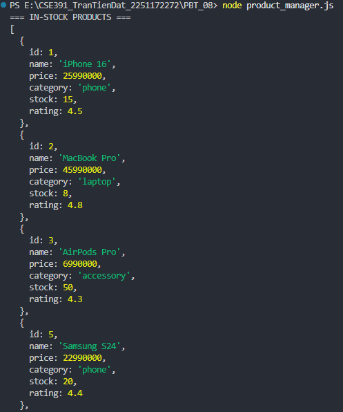
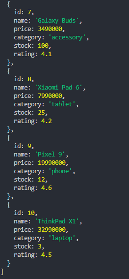
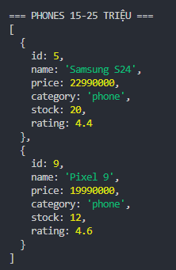
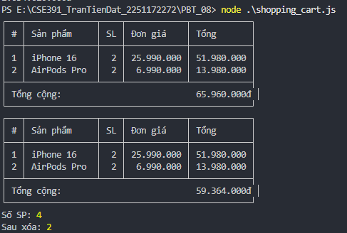
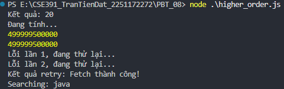

# PHẦN A

## CÂU A1

```js
// 1. Function Declaration
function tinhThueBaoHiem(luong) {
  const thue = luong > 11 ? luong * 0.1 : 0;
  return { thue, thuc_nhan: luong - thue };
}

// 2. Function Expression
const tinhThueBaoHiemExpr = function(luong) {
  const thue = luong > 11 ? luong * 0.1 : 0;
  return { thue, thuc_nhan: luong - thue };
};

// 3. Arrow Function
const tinhThueBaoHiemArrow = (luong) => {
  const thue = luong > 11 ? luong * 0.1 : 0;
  return { thue, thuc_nhan: luong - thue };
};
```

3 cách này CÓ khác nhau về hoisting  
* Function Declaration: Được hoisted toàn bộ (cả tên và thân hàm). Có thể gọi hàm trước khi khai báo  
* Function Expression & Arrow Function (dùng const/let): Chỉ hoisted phần khai báo biến vào vùng chết tạm thời (Temporal Dead Zone), không được khởi tạo giá trị. Nếu gọi trước khi khai báo sẽ báo lỗi ReferenceError.

```js
// OK
console.log(funcDecl()); 
function funcDecl() { return 1; }

// ReferenceError: Cannot access 'arrowFunc' before initialization
console.log(arrowFunc()); 
const arrowFunc = () => 1;
```

## CÂU A2

### Dự đoán code ĐOẠN 1:

```js
console.log(c.increment()); // 1
console.log(c.increment()); // 2
console.log(c.increment()); // 3
console.log(c.decrement()); // 2
console.log(c.getCount());  // 2
```

### Dự đoán code ĐOẠN :

```js
var: 3
var: 3
var: 3
// (Sau đó 100ms nữa, tức là tổng 200ms)
let: 0
let: 1
let: 2
```

### sự khác nhau giữa var và let:
* var có scope theo hàm (Function Scope) / Global: Vòng lặp for không tạo scope mới cho var. Tất cả các callback trong setTimeout đều trỏ chung về một biến i duy nhất. Khi setTimeout chạy, vòng lặp đã kết thúc và i đã tăng lên 3
* let có scope theo khối (Block Scope): Mỗi lần lặp (iteration) tạo ra một biến j hoàn toàn mới và độc lập, lưu giữ đúng giá trị của vòng lặp tại thời điểm đó

## CÂU A3

```js
const nums = [1, 2, 3, 4, 5, 6, 7, 8, 9, 10];

// 1. Lấy các số chẵn
const evens = nums.filter(n => n % 2 === 0);

// 2. Nhân mỗi số với 3
const multiplied = nums.map(n => n * 3);

// 3. Tính tổng tất cả
const sum = nums.reduce((acc, cur) => acc + cur, 0);

// 4. Tìm số đầu tiên > 7
const firstGt7 = nums.find(n => n > 7);

// 5. Kiểm tra CÓ số > 10 không
const hasGt10 = nums.some(n => n > 10);

// 6. Kiểm tra TẤT CẢ đều > 0
const allGt0 = nums.every(n => n > 0);

// 7. Tạo mảng "Số X là [chẵn/lẻ]"
const stringArr = nums.map(n => `Số ${n} là ${n % 2 === 0 ? "chẵn" : "lẻ"}`);

// 8. Đảo ngược mảng (không mutate gốc)
const reversed = [...nums].reverse(); // hoặc nums.toReversed() ở ES2023+
```

## CÂU A4

**1. Destructuring:**
```js
console.log(name, price, ram, color); // "iPhone 16" 25990000 8 "Titan"
console.log(specs);                   // ReferenceError: specs is not defined
```

**2. Spread:**
```js
console.log(updated.price);   // 23990000
console.log(updated.sale);    // true
console.log(product.price);   // 25990000 (gốc KHÔNG đổi)
```

**3. Spread Gotcha:**
```js
console.log(product.specs.ram); // 16
```

# PHẦN B

## CÂU B1





## CAU B2



## CAU B3




# PHẦN C

## CÂU C1

```js
const processOrders = (orders) => 
  orders
    .filter(({ status, total }) => status === "completed" && total > 100000)
    .map(({ id, customer, total }) => ({
      id, customer, total,
      discount: total * 0.1,
      finalTotal: total - (total * 0.1)
    }))
    .sort((a, b) => b.finalTotal - a.finalTotal);
```

## CÂU C2

```js
const miniArray = {
  map(arr, fn) {
    const result = [];
    for (let i = 0; i < arr.length; i++) {
      result.push(fn(arr[i], i, arr));
    }
    return result;
  },
  
  filter(arr, fn) {
    const result = [];
    for (let i = 0; i < arr.length; i++) {
      if (fn(arr[i], i, arr)) {
        result.push(arr[i]);
      }
    }
    return result;
  },
  
  reduce(arr, fn, initialValue) {
    let accumulator = initialValue !== undefined ? initialValue : arr[0];
    let startIndex = initialValue !== undefined ? 0 : 1;
    
    for (let i = startIndex; i < arr.length; i++) {
      accumulator = fn(accumulator, arr[i], i, arr);
    }
    return accumulator;
  }
};

// --- Test ---
console.log(miniArray.map([1, 2, 3], x => x * 2));         // -> [2, 4, 6]
console.log(miniArray.filter([1, 2, 3, 4], x => x > 2));   // -> [3, 4]
console.log(miniArray.reduce([1, 2, 3, 4], (a, b) => a + b, 0)); // -> 10
```